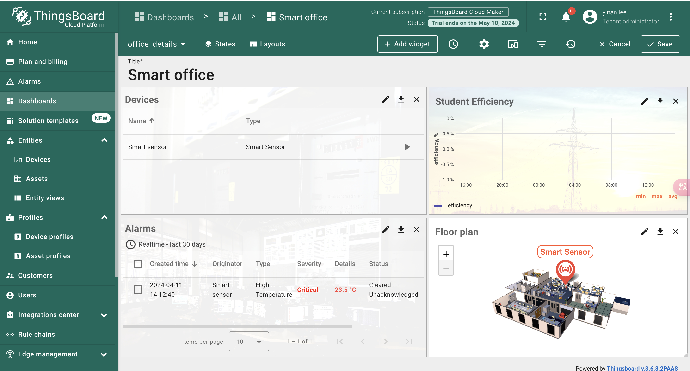
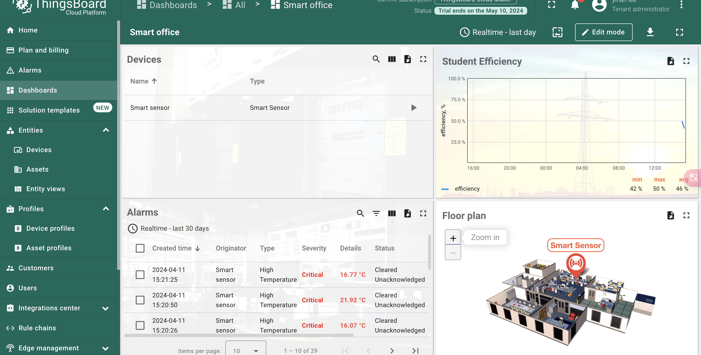
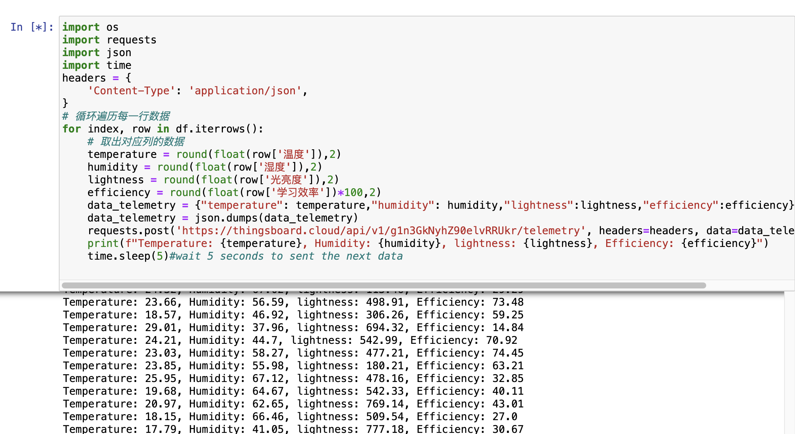

# iot_smart_classroom

#### 介绍
本项目主要基于thingsboard，实现了机器学习和thingsboard的结合。python：先使用代码随机生成1000行数据，并保存到csv文件中，然后使用线性回归、决策树回归和随机森林回归三种方法来模拟训练和测试，最终我们得到了最佳模拟模型：随机森林。thingsboard：使用python动态地将温度、湿度、光亮度三者的数据展示在thingsboard上，如果学生效率低于60%会警报。

#### 软件架构
```
Smart Classroom based on thingsboard and python
|
|————README.md //中文文档
|————README.en.md //英文文档
|————data    // python模拟的mock数据，输出为csv文件
|    └————student_efficiency_environment.csv
|————output    // 机器学习输出的图片路径
|    |————model_performance_plots.png    // 模型模拟图片
|————iot_lab5.ipynb  // 包含 mock数据产生代码，ML数据模拟代码，连接thingsboard代码
|————iot-dl.ipynb  // 包含 mock数据产生代码，DL数据模拟代码，正确率高达99%
└————thingsboard // 包含thingsboard各项配置的图片的文件夹
```

thingsboard


#### 环境准备

1.  使用自己的邮箱注册一个thingsboard官方网站账号，这时你会有一个月左右的试用时间，网站地址如：https://thingsboard.cloud/dashboards/all
2.  项目上基于官方给的智能办公（Smart Office）dashboard修改而来，所以你的大量工作在于修改他的demo
3.  我的电脑：macbook 2020 air m1
4.  python环境：python=3.11.5,pandas==2.0.3,numpy==1.26.4,json==2.0.9,sklearn==1.3.0,matplotlib==3.7.2,requests==2.31.0

#### Thingsboard配置 (极其重要)

1. 首先，你得install smart office这个模版

   

   

2. 然后就是一步步修改为我想要的smart classroom


删除 HVAC switch和它底下的指示器：


删除 右上角电脑手机图标的Entity alias里面 Office Devices 中与Energy Meter, Water Meter和HVAC相关的配置，只留下一个Smart Sensor：

- 点击右上角电脑手机图标的Entity alias
- 修改Office Devices中的最后一项 Device Type，只需要留下一个Smart Sensor


- 现在我们已经只有一个smart sensor需要修改，而这个smart sensor 他有一个专属的dashboard，我们也需要对它进行修改
- 因此，我们先点击smart office dashboard中Devices中的Smart sensor这一行或者是小三角图标，可以进入这个dashboard，先点击save，才能进入


- 然后你可以继续修改smart sensor中的各项指标，比如说删除一些我的classroom里面没有的数据：


- 然后你再添加一些你自己需要的数据，比如说，我需要在我的smart classroom里面有温度（temperature），湿度（humidity），光亮度（lightness）以及最终的学生学习效率（efficiency）
- 所以我直接复制右上角的temperature card发现，所有的变量、颜色以及单位都一样，所以我需要重新修改这些变量

#### 


所以你大部分只需要修改一下主题和单位就可以，当然还有数据源

- 修改单位


- 修改名字


- 修改颜色


- 因此


- 以此类推，保存以后，你将修改contact info，这几个变量全部都集成在 assert下面的Office的attributes里面，你可以修改为自己的的邮箱和地址等，然后这个floorPlan千万不要删除，这个与你的smart office dashboard里面的地图组件强相关


- 修改完成后，你可以对dashboard首页右上角的图片进行修改


- 我将会将它修改为学生学习效率的图片，你可以点击edit之后，对数据源进行修改。


- 修改时，发现这个里面并没有数据源为student efficiency这个数据，所以我们需要新建一个：


然后我们删除第二个数据源，保留刚刚新建好的数据源：


和前面一样我们需要修改这个图片的纵坐标的数据类型和单位，我将修改为efficiency，%


完成：




点击save，保存项目。

- 在进行代码测试之前，我们还需要修改smart-sensor 这个设备的遥测变量


不难发现，有很多变量已经没有用了，并且我还需要添加lightness和efficienty

- 接下来，我们修改smart sensor的 latest telementry 


- 让我们来试一试能不能使用https协议，用python进行数据的post请求

代码如下：（你需要根据ipynb文件里面进行修改）

```python
import os
import requests
import json 
import time
headers = {
    'Content-Type': 'application/json',
}
# 循环遍历每一行数据
for index, row in df.iterrows():
    # 取出对应列的数据
    temperature = round(float(row['温度']),2)
    humidity = round(float(row['湿度']),2)
    lightness = round(float(row['光亮度']),2)
    efficiency = round(float(row['学习效率'])*100,2)
    data_telemetry = {"temperature": temperature,"humidity": humidity,"lightness":lightness,"efficiency":efficiency}#initialization
    data_telemetry = json.dumps(data_telemetry)
    requests.post('https://thingsboard.cloud/api/v1/你的设备号/telemetry', headers=headers, data=data_telemetry)
    print(f"Temperature: {temperature}, Humidity: {humidity}, lightness: {lightness}, Efficiency: {efficiency}")
    time.sleep(5)#wait 5 seconds to sent the next data
    
```

不出意外的话，你只需要修改 **https://thingsboard.cloud/api/v1/你的设备号/telemetry** 这中间的设备号替换为你的真正的smart sensor 设备号即可：

- 设备号在这里：


smart sensor 后面的小盾牌图标，点击你就得到设备号

#### 

连接成功后，就会发现，这些值在动：


而且你的设备也处于active的状态：


- 如果，你点击smart office里面devices中的smart_sensor，你会发现，这几个图表都在动态变化，这意味着我们的数据传输成功了！


- 依据上图，我没发现lightness 这个card的数据不大对劲，我们重新设置他的阈值：


ok，正常了！

- student efficiency 也正常显示了



- 现在，我们需要去修改alarms的规则：由于alarms是基于之前的规则产生的，所以，根据我们smart classroom的设想，我们需要将学生的学习效率作为最终的评判标准，因此为设置如果学习效率低于50%就报警：

- 修改的页面在device profiles的smart-sensor中的alarm rules


- 修改后为：


所以我们有这样一个low efficiency的警告


- 增加逻辑链，虽然不一定能派上用场：


#### Python代码说明 
##### 1.产生随机数
##### 2.保存到csv文件方便读取

##### 3.使用机器学习的方法进行模型拟合
- 将数据集分成 训练集80% 测试集20%

- 使用 三种机器学习方法进行模拟：Linear Regression, Decision Tree, Random Forest

- 画出模拟结果

- 使用 MSE 和 MAE 评估三种模型的性能
- 得出最终的结论

##### 4.连接thingsboard
- 将温度，湿度，光亮度以及学生的学习效率等数据发送到smart-sensor

- 查看requests的打印信息

#### 最后完美项目的截图


#### 作者

- City University Of Hongkong 李奕楠 LiYinan
- email：17856560989@163.com 
- 如果有任何项目相关问题，可以发邮件询问我，能力有限，恳请批评指正

#### 引用

- https://thingsboard.io/use-cases/smart-office/

